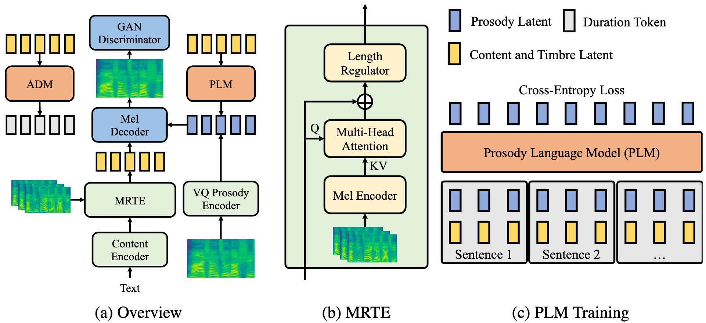

# Mega-TTS 2
# Zero-Shot Text-to-Speech with Arbitrary Length Speech Prompts

## Abstract
Zero-shot text-to-speech aims at synthesizing voices with unseen speech prompts. Previous large-scale multispeaker TTS models, such as Mega-TTS, have successfully achieved this goal with an enrolled recording within 10 seconds. However, most of them are designed to utilize only short speech prompts. The limited information in short speech prompts significantly hinders the performance of fine-grained identity imitation. In this paper, we introduce Mega-TTS 2, a generic zero-shot multispeaker TTS model that is capable of synthesizing speech for unseen speakers with arbitrary-length prompts. Specifically, we 1) design a multi-reference timbre encoder to extract timbre information from multiple reference speeches; 2) and train a prosody language model with arbitrary-length speech prompts; With these designs, our model is suitable for prompts of different lengths, which extends the upper bound of speech quality for zero-shot text-to-speech. Furthermore, we propose a phoneme-level auto-regressive duration model to introduce in-context learning capabilities to duration modeling. Experiments demonstrate that our method could not only synthesize identity-preserving speech with a short prompt of an unseen speaker but also achieve improved performance with longer speech prompts.

[*] This page is for <strong>research demonstration purposes</strong> only.

<h2> Cloning Our Voices </h2>
Hey! We are the authors of Mega-TTS 2! Here we perform prompt-based zero-shot TTS to clone our voices and the results are shown below:

<b>Transcriptions</b>:
1. 我们主要提供装修的服务，您有装修方面的需求吗？
2. 您看，您这个行业的很多客户，都通过线上推广实现销量增长了。
3. 嗯那麻烦问一下，您这边是做什么行业的呢？
4. 非常抱歉，也就是想了解一下您有多大的可能会将我们的广告服务推荐给其他人？

<table border="0" width="100%">
  <thead>
    <tr>
      <th align="center"><strong>Name</strong></th>
      <th align="center"><strong>Prompt</strong></th>
      <th align="center"><strong>Sentence 1</strong></th>
      <th align="center"><strong>Sentence 2</strong></th>
      <th align="center"><strong>Sentence 3</strong></th>
      <th align="center"><strong>Sentence 4</strong></th>
    </tr>
  </thead>
  <tbody>
    <tr>
      <td width="28%">
Ziyue Jiang
</td>
      <td width="12%" style="text-align: center;"><audio controls="" ><source src="audio_sample/our_voices/jzy/prompt.wav" type="audio/wav"></audio></td>
      <td width="12%" style="text-align: center;"><audio controls="" ><source src="audio_sample/our_voices/jzy/1.wav" type="audio/wav"></audio></td>
      <td width="12%" style="text-align: center;"><audio controls="" ><source src="audio_sample/our_voices/jzy/2.wav" type="audio/wav"></audio></td>
      <td width="12%" style="text-align: center;"><audio controls="" ><source src="audio_sample/our_voices/jzy/3.wav" type="audio/wav"></audio></td>
      <td width="12%" style="text-align: center;"><audio controls="" ><source src="audio_sample/our_voices/jzy/4.wav" type="audio/wav"></audio></td>
    </tr>
    <tr>
      <td width="28%">
Jinglin Liu
</td>
      <td width="12%" style="text-align: center;"><audio controls="" ><source src="audio_sample/our_voices/ljl/prompt.wav" type="audio/wav"></audio></td>
      <td width="12%" style="text-align: center;"><audio controls="" ><source src="audio_sample/our_voices/ljl/1.wav" type="audio/wav"></audio></td>
      <td width="12%" style="text-align: center;"><audio controls="" ><source src="audio_sample/our_voices/ljl/2.wav" type="audio/wav"></audio></td>
      <td width="12%" style="text-align: center;"><audio controls="" ><source src="audio_sample/our_voices/ljl/3.wav" type="audio/wav"></audio></td>
      <td width="12%" style="text-align: center;"><audio controls="" ><source src="audio_sample/our_voices/ljl/4.wav" type="audio/wav"></audio></td>
    </tr>
  </tbody>
</table>

<h2> Zero-Shot TTS Samples </h2>
In this experiment, we only use one-sentence prompt to compare the speech naturalness of these systems.
<table border="0" width="100%">
  <thead>
    <tr>
      <th align="center"><strong>Text</strong></th>
      <th align="center"><strong>Speaker Prompt</strong></th>
      <th align="center"><strong>Ground Truth</strong></th>
      <th align="center"><strong>YourTTS</strong></th>
      <th align="center"><strong>VALL-E</strong></th>
      <th align="center"><strong>Mega-TTS</strong></th>
      <th align="center"><strong>Mega-TTS 2</strong></th>
    </tr>
  </thead>
  <tbody>
    <tr>
      <td width="28%">
He was in deep converse with the clerk and entered the hall holding him by the arm.
</td>
      <td width="12%" style="text-align: center;"><audio controls="" ><source src="audio_sample/zero-shot_TTS/prompt/4.wav" type="audio/wav"></audio></td>
      <td width="12%" style="text-align: center;"><audio controls="" ><source src="audio_sample/zero-shot_TTS/gt/4.wav" type="audio/wav"></audio></td>
      <td width="12%" style="text-align: center;"><audio controls="" ><source src="audio_sample/zero-shot_TTS/yourtts/4.wav" type="audio/wav"></audio></td>
      <td width="12%" style="text-align: center;"><audio controls="" ><source src="audio_sample/zero-shot_TTS/valle/4.wav" type="audio/wav"></audio></td>
      <td width="12%" style="text-align: center;"><audio controls="" ><source src="audio_sample/zero-shot_TTS/mega-tts/4.wav" type="audio/wav"></audio></td>
      <td width="12%" style="text-align: center;"><audio controls="" ><source src="audio_sample/zero-shot_TTS/mega-tts2/4.wav" type="audio/wav"></audio></td>
    </tr>
    <tr>
      <td width="28%">
Yea, his honourable worship is within, but he hath a godly minister or two with him, and likewise a leech.
</td>
      <td width="12%" style="text-align: center;"><audio controls="" ><source src="audio_sample/zero-shot_TTS/prompt/1.wav" type="audio/wav"></audio></td>
      <td width="12%" style="text-align: center;"><audio controls="" ><source src="audio_sample/zero-shot_TTS/gt/1.wav" type="audio/wav"></audio></td>
      <td width="12%" style="text-align: center;"><audio controls="" ><source src="audio_sample/zero-shot_TTS/yourtts/1.wav" type="audio/wav"></audio></td>
      <td width="12%" style="text-align: center;"><audio controls="" ><source src="audio_sample/zero-shot_TTS/valle/1.wav" type="audio/wav"></audio></td>
      <td width="12%" style="text-align: center;"><audio controls="" ><source src="audio_sample/zero-shot_TTS/mega-tts/1.wav" type="audio/wav"></audio></td>
      <td width="12%" style="text-align: center;"><audio controls="" ><source src="audio_sample/zero-shot_TTS/mega-tts2/1.wav" type="audio/wav"></audio></td>
    </tr>
    <tr>
      <td width="28%">
Instead of shoes, the old man wore boots with turnover tops, and his blue coat had wide cuffs of gold braid.
</td>
      <td width="12%" style="text-align: center;"><audio controls="" ><source src="audio_sample/zero-shot_TTS/prompt/2.wav" type="audio/wav"></audio></td>
      <td width="12%" style="text-align: center;"><audio controls="" ><source src="audio_sample/zero-shot_TTS/gt/2.wav" type="audio/wav"></audio></td>
      <td width="12%" style="text-align: center;"><audio controls="" ><source src="audio_sample/zero-shot_TTS/yourtts/2.wav" type="audio/wav"></audio></td>
      <td width="12%" style="text-align: center;"><audio controls="" ><source src="audio_sample/zero-shot_TTS/valle/2.wav" type="audio/wav"></audio></td>
      <td width="12%" style="text-align: center;"><audio controls="" ><source src="audio_sample/zero-shot_TTS/mega-tts/2.wav" type="audio/wav"></audio></td>
      <td width="12%" style="text-align: center;"><audio controls="" ><source src="audio_sample/zero-shot_TTS/mega-tts2/2.wav" type="audio/wav"></audio></td>
    </tr>
    <tr>
      <td width="28%">
The army found the people in poverty and left them in comparative wealth.
</td>
      <td width="12%" style="text-align: center;"><audio controls="" ><source src="audio_sample/zero-shot_TTS/prompt/3.wav" type="audio/wav"></audio></td>
      <td width="12%" style="text-align: center;"><audio controls="" ><source src="audio_sample/zero-shot_TTS/gt/3.wav" type="audio/wav"></audio></td>
      <td width="12%" style="text-align: center;"><audio controls="" ><source src="audio_sample/zero-shot_TTS/yourtts/3.wav" type="audio/wav"></audio></td>
      <td width="12%" style="text-align: center;"><audio controls="" ><source src="audio_sample/zero-shot_TTS/valle/3.wav" type="audio/wav"></audio></td>
      <td width="12%" style="text-align: center;"><audio controls="" ><source src="audio_sample/zero-shot_TTS/mega-tts/3.wav" type="audio/wav"></audio></td>
      <td width="12%" style="text-align: center;"><audio controls="" ><source src="audio_sample/zero-shot_TTS/mega-tts2/3.wav" type="audio/wav"></audio></td>
    </tr>
  </tbody>
</table>

<h2> Expanding the Prompt Length </h2>
In this experiment, we illustrate the speech samples generated by our MegaTTS 2 with different prosody prompt length. Note that if the prompt is less than 10 seconds, we will repeat it to get 10-seconds timbre prompt.
<table border="0" width="100%">
  <thead>
    <tr>
      <th align="center"><strong>Text</strong></th>
      <th align="center"><strong>Ground Truth</strong></th>
      <th align="center"><strong>1 sentence</strong></th>
      <th align="center"><strong>10 sentences</strong></th>
      <th align="center"><strong>30 sentences</strong></th>
    </tr>
  </thead>
  <tbody>
    <tr>
      <td width="28%">
He was in deep converse with the clerk and entered the hall holding him by the arm.
</td>
      <td width="12%" style="text-align: center;"><audio controls="" ><source src="audio_sample/zero-shot_TTS/prompt/4.wav" type="audio/wav"></audio></td>
      <td width="12%" style="text-align: center;"><audio controls="" ><source src="audio_sample/zero-shot_TTS/gt/4.wav" type="audio/wav"></audio></td>
      <td width="12%" style="text-align: center;"><audio controls="" ><source src="audio_sample/zero-shot_TTS/yourtts/4.wav" type="audio/wav"></audio></td>
      <td width="12%" style="text-align: center;"><audio controls="" ><source src="audio_sample/zero-shot_TTS/valle/4.wav" type="audio/wav"></audio></td>
      <td width="12%" style="text-align: center;"><audio controls="" ><source src="audio_sample/zero-shot_TTS/mega-tts/4.wav" type="audio/wav"></audio></td>
      <td width="12%" style="text-align: center;"><audio controls="" ><source src="audio_sample/zero-shot_TTS/mega-tts2/4.wav" type="audio/wav"></audio></td>
    </tr>
    <tr>
      <td width="28%">
Yea, his honourable worship is within, but he hath a godly minister or two with him, and likewise a leech.
</td>
      <td width="12%" style="text-align: center;"><audio controls="" ><source src="audio_sample/zero-shot_TTS/prompt/1.wav" type="audio/wav"></audio></td>
      <td width="12%" style="text-align: center;"><audio controls="" ><source src="audio_sample/zero-shot_TTS/gt/1.wav" type="audio/wav"></audio></td>
      <td width="12%" style="text-align: center;"><audio controls="" ><source src="audio_sample/zero-shot_TTS/yourtts/1.wav" type="audio/wav"></audio></td>
      <td width="12%" style="text-align: center;"><audio controls="" ><source src="audio_sample/zero-shot_TTS/valle/1.wav" type="audio/wav"></audio></td>
      <td width="12%" style="text-align: center;"><audio controls="" ><source src="audio_sample/zero-shot_TTS/mega-tts/1.wav" type="audio/wav"></audio></td>
      <td width="12%" style="text-align: center;"><audio controls="" ><source src="audio_sample/zero-shot_TTS/mega-tts2/1.wav" type="audio/wav"></audio></td>
    </tr>
    <tr>
      <td width="28%">
Instead of shoes, the old man wore boots with turnover tops, and his blue coat had wide cuffs of gold braid.
</td>
      <td width="12%" style="text-align: center;"><audio controls="" ><source src="audio_sample/zero-shot_TTS/prompt/2.wav" type="audio/wav"></audio></td>
      <td width="12%" style="text-align: center;"><audio controls="" ><source src="audio_sample/zero-shot_TTS/gt/2.wav" type="audio/wav"></audio></td>
      <td width="12%" style="text-align: center;"><audio controls="" ><source src="audio_sample/zero-shot_TTS/yourtts/2.wav" type="audio/wav"></audio></td>
      <td width="12%" style="text-align: center;"><audio controls="" ><source src="audio_sample/zero-shot_TTS/valle/2.wav" type="audio/wav"></audio></td>
      <td width="12%" style="text-align: center;"><audio controls="" ><source src="audio_sample/zero-shot_TTS/mega-tts/2.wav" type="audio/wav"></audio></td>
      <td width="12%" style="text-align: center;"><audio controls="" ><source src="audio_sample/zero-shot_TTS/mega-tts2/2.wav" type="audio/wav"></audio></td>
    </tr>
    <tr>
      <td width="28%">
The army found the people in poverty and left them in comparative wealth.
</td>
      <td width="12%" style="text-align: center;"><audio controls="" ><source src="audio_sample/zero-shot_TTS/prompt/3.wav" type="audio/wav"></audio></td>
      <td width="12%" style="text-align: center;"><audio controls="" ><source src="audio_sample/zero-shot_TTS/gt/3.wav" type="audio/wav"></audio></td>
      <td width="12%" style="text-align: center;"><audio controls="" ><source src="audio_sample/zero-shot_TTS/yourtts/3.wav" type="audio/wav"></audio></td>
      <td width="12%" style="text-align: center;"><audio controls="" ><source src="audio_sample/zero-shot_TTS/valle/3.wav" type="audio/wav"></audio></td>
      <td width="12%" style="text-align: center;"><audio controls="" ><source src="audio_sample/zero-shot_TTS/mega-tts/3.wav" type="audio/wav"></audio></td>
      <td width="12%" style="text-align: center;"><audio controls="" ><source src="audio_sample/zero-shot_TTS/mega-tts2/3.wav" type="audio/wav"></audio></td>
    </tr>
  </tbody>
</table>